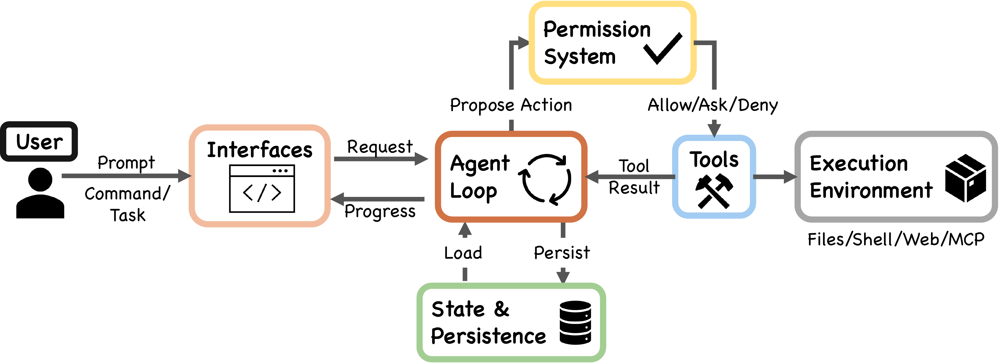
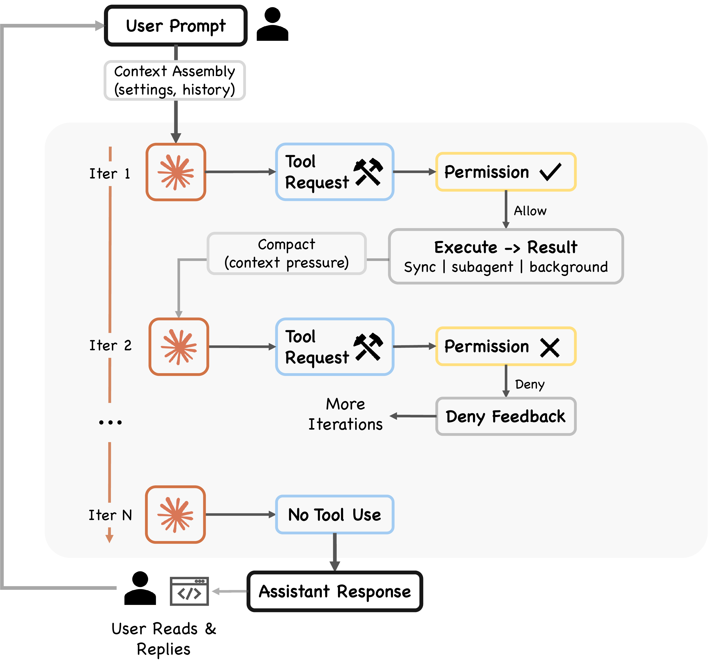
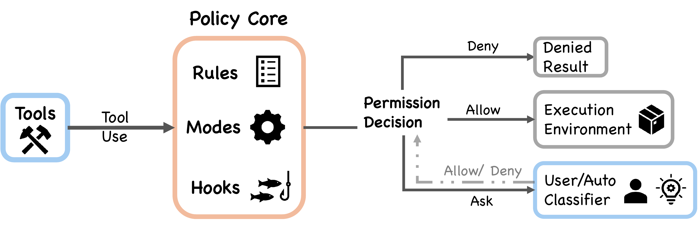
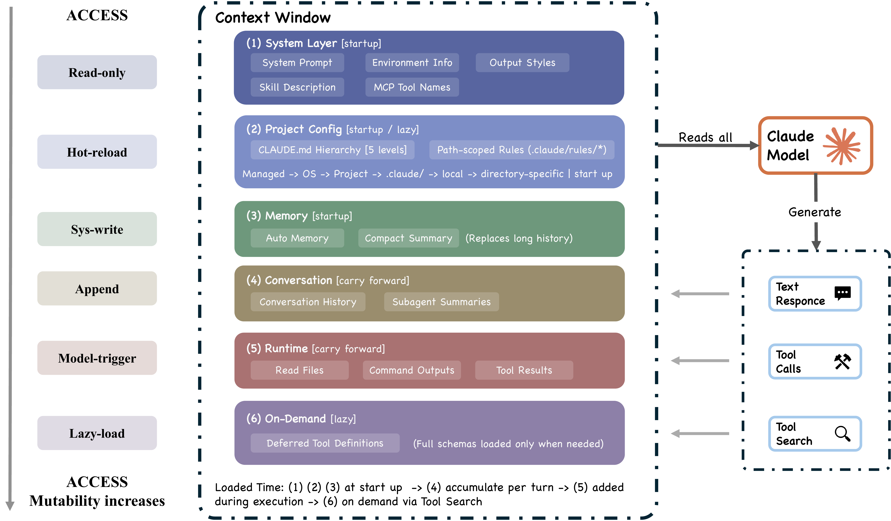
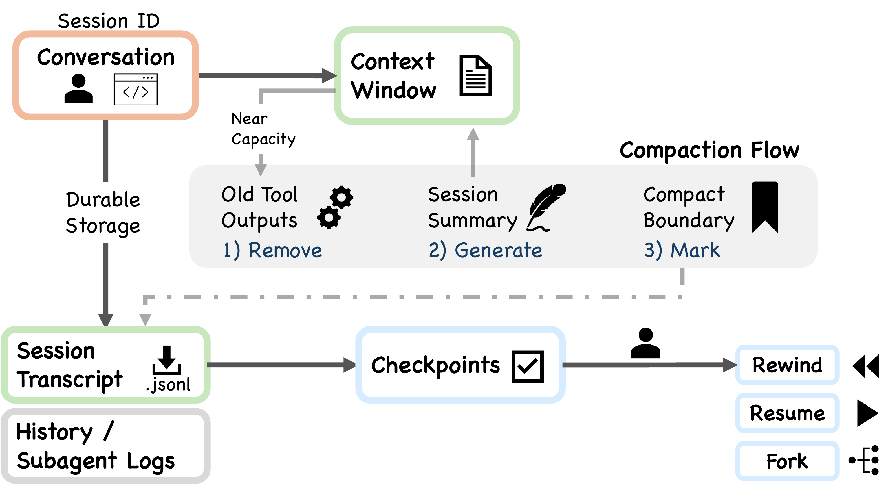

# Dive into Claude Code

<p align="center">
  
</p>

<p align="center">
  <a href="https://arxiv.org/abs/XXXX.XXXXX"></a>
  <a href="./LICENSE"></a>
  <a href="https://github.com/VILA-Lab/Dive-into-ClaudeCode/stargazers"></a>
</p>

> **A comprehensive source-level architectural analysis of Claude Code (v2.1.88, ~1,900 TypeScript files, ~512K lines of code), combined with a curated collection of community analyses, a design-space guide for agent builders, and cross-system comparisons.**

<!-- TODO: Update author list -->
**Authors:** _To be updated._

> [!TIP]
> **TL;DR** -- Only 1.6% of Claude Code's codebase is AI decision logic. The other 98.4% is deterministic infrastructure -- permission gates, context management, tool routing, and recovery logic. The agent loop is a simple while-loop; the real engineering complexity lives in the systems around it. This repo dissects that architecture and distills it into actionable design guidance for anyone building AI agent systems.

---

## Table of Contents

**From Our Paper**

- [🌟 Key Highlights](#key-highlights)
- [📖 Reading Guide](#reading-guide)
- [🏗️ Architecture at a Glance](#architecture-at-a-glance)
- [🧭 Values and Design Principles](#values-and-design-principles)
- [🔄 The Agentic Query Loop](#the-agentic-query-loop)
- [🛡️ Safety and Permissions](#safety-and-permissions)
- [🧩 Extensibility](#extensibility)
- [🧠 Context and Memory](#context-and-memory)
- [👥 Subagent Delegation](#subagent-delegation)
- [💾 Session Persistence](#session-persistence)

**Beyond the Paper**

- [🛠️ Build Your Own AI Agent: A Design Guide](#build-your-own-ai-agent-a-design-guide)
- [🌐 Community Projects & Research](#community-projects--research)
- [🔖 Citation](#citation)

---

## Key Highlights

- **98.4% Infrastructure, 1.6% AI** -- The agent loop is a simple while-loop; the real complexity is permission gates, context management, and recovery logic.
- **5 Values → 13 Principles → Implementation** -- Every design choice traces back to human authority, safety, reliability, capability, and adaptability.
- **Defense in Depth with Shared Failure Modes** -- 7 safety layers, but all share token-cost constraints. 50+ subcommands bypass security analysis.
- **5 CVEs from One Root Cause** -- Extensions execute *before* the trust dialog appears.
- **The Cross-Cutting Harness Resists Reimplementation** -- The loop is easy to copy; hooks, classifier, compaction, and isolation are not.

---

## Reading Guide

| If you are a... | Start here | Then read |
|:----------------|:-----------|:----------|
| **Agent Builder** | [Build Your Own Agent](./docs/build-your-own-agent.md) | [Architecture Deep Dive](./docs/architecture.md) |
| **Security Researcher** | [Safety and Permissions](#safety-and-permissions) | [Architecture: Safety Layers](./docs/architecture.md#seven-independent-safety-layers) |
| **Product Manager** | [Key Highlights](#key-highlights) | [Values and Principles](#values-and-design-principles) |
| **Researcher** | [Full Paper (arXiv)](https://arxiv.org/abs/XXXX.XXXXX) | [Community Resources](#community-projects--research) |

`1,884 files` ·  `~512K lines` ·  `v2.1.88` ·  `7 safety layers` ·  `5 compaction stages` ·  `54 tools` ·  `27 hook events` ·  `4 extension mechanisms` ·  `7 permission modes`

---

<details open>
<summary><h2>Architecture at a Glance</h2></summary>

Claude Code answers **four design questions** that every production coding agent must face:

| Question | Claude Code's Answer |
|:---------|:---------------------|
| Where does reasoning live? | Model reasons; harness enforces. ~1.6% AI, 98.4% infrastructure. |
| How many execution engines? | One `queryLoop` for all interfaces (CLI, SDK, IDE). |
| Default safety posture? | Deny-first: deny > ask > allow. Strictest rule wins. |
| Binding resource constraint? | ~200K-token context window. 5 compaction layers before every model call. |

The system decomposes into **7 components** (User → Interfaces → Agent Loop → Permission System → Tools → State & Persistence → Execution Environment) across **5 layers** expanding into 21 subsystems.

<p align="center">
  
</p>

> [!NOTE]
> For the full architectural deep dive -- 7 safety layers, 9-step turn pipeline, 5-layer compaction, and more -- see **[docs/architecture.md](./docs/architecture.md)**.

<p align="right"><a href="#dive-into-claude-code-the-design-space-of-todays-ai-agent-system">↑ Back to top</a></p>

</details>

---

<details open>
<summary><h2>Values and Design Principles</h2></summary>

The architecture traces from **5 human values** through **13 design principles** to implementation:

| Value | Core Idea |
|:------|:----------|
| **Human Decision Authority** | Humans retain control via principal hierarchy. When 93% approval rate showed fatigue, response was restructured boundaries, not more warnings. |
| **Safety, Security, Privacy** | System protects even when human vigilance lapses. 7 independent safety layers. |
| **Reliable Execution** | Does what was meant. Gather-act-verify loop. Graceful recovery. |
| **Capability Amplification** | "A Unix utility, not a product." 98.4% is deterministic infrastructure enabling the model. |
| **Contextual Adaptability** | CLAUDE.md hierarchy, graduated extensibility, trust trajectories that evolve over time. |

<details>
<summary><b>The 13 Design Principles</b></summary>

| Principle | Design Question |
|:----------|:----------------|
| Deny-first with human escalation | Should unrecognized actions be allowed, blocked, or escalated? |
| Graduated trust spectrum | Fixed permission level, or spectrum users traverse over time? |
| Defense in depth | Single safety boundary, or multiple overlapping ones? |
| Externalized programmable policy | Hardcoded policy, or externalized configs with lifecycle hooks? |
| Context as scarce resource | Single-pass truncation or graduated pipeline? |
| Append-only durable state | Mutable state, snapshots, or append-only logs? |
| Minimal scaffolding, maximal harness | Invest in scaffolding or operational infrastructure? |
| Values over rules | Rigid procedures or contextual judgment with deterministic guardrails? |
| Composable multi-mechanism extensibility | One API or layered mechanisms at different costs? |
| Reversibility-weighted risk assessment | Same oversight for all, or lighter for reversible actions? |
| Transparent file-based config and memory | Opaque DB, embeddings, or user-visible files? |
| Isolated subagent boundaries | Shared context/permissions, or isolation? |
| Graceful recovery and resilience | Fail hard, or recover silently? |

</details>

The paper also applies a **sixth evaluative lens** -- long-term capability preservation -- citing evidence that developers who fully delegate to AI score 17% lower on comprehension tests.

<p align="right"><a href="#dive-into-claude-code-the-design-space-of-todays-ai-agent-system">↑ Back to top</a></p>

</details>

---

<details>
<summary><h2>The Agentic Query Loop</h2></summary>

<p align="center">
  
</p>

The core is a **ReAct-pattern while-loop**: assemble context → call model → dispatch tools → check permissions → execute → repeat. Implemented as an `AsyncGenerator` yielding streaming events.

**Before every model call**, five compaction shapers run sequentially (cheapest first): Budget Reduction → Snip → Microcompact → Context Collapse → Auto-Compact.

**9-step pipeline per turn:** Settings resolution → State init → Context assembly → 5 pre-model shapers → Model call → Tool dispatch → Permission gate → Tool execution → Stop condition

**Two execution paths:**
- `StreamingToolExecutor` -- begins executing tools as they stream in (latency optimization)
- Fallback `runTools` -- classifies tools as concurrent-safe or exclusive

**Recovery:** Max output token escalation (3 retries), reactive compaction (once per turn), prompt-too-long handling, streaming fallback, fallback model

**5 stop conditions:** No tool use, max turns, context overflow, hook intervention, explicit abort

<p align="right"><a href="#dive-into-claude-code-the-design-space-of-todays-ai-agent-system">↑ Back to top</a></p>

</details>

---

<details open>
<summary><h2>Safety and Permissions</h2></summary>

<p align="center">
  
</p>

**7 permission modes** form a graduated trust spectrum: `plan` → `default` → `acceptEdits` → `auto` (ML classifier) → `dontAsk` → `bypassPermissions` (+ internal `bubble`).

**Deny-first**: A broad deny *always* overrides a narrow allow. **7 independent safety layers** from tool pre-filtering through shell sandboxing to hook interception. Permissions are **never restored on resume** -- trust is re-established per session.

> [!WARNING]
> **Shared failure modes:** Defense-in-depth degrades when layers share constraints. All safety layers share token economics -- commands exceeding 50 subcommands bypass security analysis entirely due to token cost.

<details>
<summary><b>More details: authorization pipeline, auto-mode classifier, CVEs</b></summary>

**Authorization pipeline:** Pre-filtering (strip denied tools) → PreToolUse hooks → Deny-first rule evaluation → Permission handler (4 branches: coordinator, swarm worker, speculative classifier, interactive)

**Auto-mode classifier** (`yoloClassifier.ts`): Separate LLM call with internal/external permission templates. Two-stage: fast-filter + chain-of-thought.

**Pre-trust execution window:** 5 patched CVEs share root cause -- hooks and MCP servers execute during initialization *before* the trust dialog appears, creating a structurally privileged attack window outside the deny-first pipeline.

</details>

<p align="right"><a href="#dive-into-claude-code-the-design-space-of-todays-ai-agent-system">↑ Back to top</a></p>

</details>

---

<details>
<summary><h2>Extensibility</h2></summary>

<p align="center">
  
</p>

**Four mechanisms at graduated context costs:** Hooks (zero) → Skills (low) → Plugins (medium) → MCP (high). Three injection points in the agent loop: **assemble()** (what the model sees), **model()** (what it can reach), **execute()** (whether/how actions run).

**Tool pool assembly** (5-step): Base enumeration (up to 54 tools) → Mode filtering → Deny pre-filtering → MCP integration → Deduplication

**27 hook events** across 5 categories with 4 execution types (shell, LLM-evaluated, webhook, subagent verifier)

**Plugin manifest** accepts 10 component types: commands, agents, skills, hooks, MCP servers, LSP servers, output styles, channels, settings, user config

**Skills:** SKILL.md with 15+ YAML frontmatter fields. Key difference -- SkillTool injects into current context; AgentTool spawns isolated context.

<p align="right"><a href="#dive-into-claude-code-the-design-space-of-todays-ai-agent-system">↑ Back to top</a></p>

</details>

---

<details open>
<summary><h2>Context and Memory</h2></summary>

<p align="center">
  
</p>

**9 ordered sources** build the context window. CLAUDE.md instructions are delivered as **user context** (probabilistic compliance), not system prompt (deterministic). Memory is **file-based** (no vector DB) -- fully inspectable, editable, version-controllable.

**4-level CLAUDE.md hierarchy:** Managed (`/etc/`) → User (`~/.claude/`) → Project (`CLAUDE.md`, `.claude/rules/`) → Local (`CLAUDE.local.md`, gitignored)

**5-layer compaction** (graduated lazy-degradation): Budget reduction → Snip → Microcompact → Context Collapse (read-time projection, non-destructive) → Auto-Compact (full model summary, last resort)

**Memory retrieval:** LLM-based scan of memory-file headers, selects up to 5 relevant files. No embeddings, no vector similarity.

<p align="right"><a href="#dive-into-claude-code-the-design-space-of-todays-ai-agent-system">↑ Back to top</a></p>

</details>

---

<details>
<summary><h2>Subagent Delegation</h2></summary>

<p align="center">
  
</p>

**6 built-in types** (Explore, Plan, General-purpose, Guide, Verification, Statusline) + custom agents via `.claude/agents/*.md`. **Sidechain transcripts**: only summaries return to parent (~7x token cost). Three isolation modes: worktree, remote, in-process. Coordination via POSIX `flock()`.

**SkillTool vs AgentTool:** SkillTool injects into current context (cheap). AgentTool spawns isolated context (expensive, but prevents context explosion).

**Permission override:** Subagent `permissionMode` applies UNLESS parent is in `bypassPermissions`/`acceptEdits`/`auto` (explicit user decisions always take precedence).

**Custom agents:** YAML frontmatter supports tools, disallowedTools, model, effort, permissionMode, mcpServers, hooks, maxTurns, skills, memory scope, background flag, isolation mode.

<p align="right"><a href="#dive-into-claude-code-the-design-space-of-todays-ai-agent-system">↑ Back to top</a></p>

</details>

---

<details>
<summary><h2>Session Persistence</h2></summary>

<p align="center">
  
</p>

Three channels: append-only JSONL transcripts, global prompt history, subagent sidechains. **Permissions never restored on resume** -- trust is re-established per session. Design favors **auditability over query power**.

**Chain patching:** Compact boundaries record `headUuid`/`anchorUuid`/`tailUuid`. The session loader patches the message chain at read time. Nothing is destructively edited on disk.

**Checkpoints:** File-history checkpoints for `--rewind-files`, stored at `~/.claude/file-history/<sessionId>/`.

<p align="right"><a href="#dive-into-claude-code-the-design-space-of-todays-ai-agent-system">↑ Back to top</a></p>

</details>

---

## Build Your Own AI Agent: A Design Guide

> Not a coding tutorial. A guide to the **design decisions** you must make, derived from architectural analysis.

Every production agent must navigate these six decisions:

| Decision | The Question | Key Insight |
|:---------|:-------------|:------------|
| [**Reasoning placement**](./docs/build-your-own-agent.md#decision-1-where-does-reasoning-live) | How much logic in the model vs. harness? | As models converge in capability, the harness becomes the differentiator. |
| [**Safety posture**](./docs/build-your-own-agent.md#decision-2-what-is-your-safety-posture) | How do you prevent harmful actions? | Defense-in-depth fails when layers share failure modes. |
| [**Context management**](./docs/build-your-own-agent.md#decision-3-how-do-you-manage-context) | What does the model see? | Design for context scarcity from day one. Graduated > single-pass. |
| [**Extensibility**](./docs/build-your-own-agent.md#decision-4-how-do-you-handle-extensibility) | How do extensions plug in? | Not all extensions need to consume context tokens. |
| [**Subagent architecture**](./docs/build-your-own-agent.md#decision-5-how-do-subagents-work) | Shared or isolated context? | Subagent sessions cost ~7x tokens. Summary-only returns are essential. |
| [**Session persistence**](./docs/build-your-own-agent.md#decision-6-how-do-sessions-persist) | What carries over? | Never restore permissions on resume. Auditability > query power. |

**Read the full guide: [docs/build-your-own-agent.md](./docs/build-your-own-agent.md)**

<p align="right"><a href="#dive-into-claude-code-the-design-space-of-todays-ai-agent-system">↑ Back to top</a></p>

---

## Community Projects & Research

A curated map of the repos, reimplementations, and academic papers surrounding Claude Code's architecture.

### Architecture Analysis

Deep dives into Claude Code's internal design.

| Repository | Description |
|:-----------|:------------|
| [**ComeOnOliver/claude-code-analysis**](https://github.com/ComeOnOliver/claude-code-analysis) | Comprehensive reverse-engineering: source tree structure, module boundaries, tool inventories, and architectural patterns. |
| [**alejandrobalderas/claude-code-from-source**](https://github.com/alejandrobalderas/claude-code-from-source) | 18-chapter technical book (~400 pages). All original pseudocode, no proprietary source. |
| [**liuup/claude-code-analysis**](https://github.com/liuup/claude-code-analysis) | Chinese-language deep-dive — startup flow, query main loop, MCP integration, multi-agent architecture. |
| [**sanbuphy/claude-code-source-code**](https://github.com/sanbuphy/claude-code-source-code) | Quadrilingual analysis (EN/JA/KO/ZH) — 10 domains, 75 reports. Covers telemetry, codenames, KAIROS, unreleased tools. |
| [**cablate/claude-code-research**](https://github.com/cablate/claude-code-research) | Independent research on internals, Agent SDK, and related tooling. |
| [**Yuyz0112/claude-code-reverse**](https://github.com/Yuyz0112/claude-code-reverse) | Visualize Claude Code's LLM interactions — log parser and visual tool to trace prompts, tool calls, and compaction. |

### Open-Source Reimplementations

Clean-room rewrites and buildable research forks.

| Repository | Description |
|:-----------|:------------|
| [**chauncygu/collection-claude-code-source-code**](https://github.com/chauncygu/collection-claude-code-source-code) | Meta-collection — claw-code (Rust, 30K+ stars), nano-claude-code (Python ~5K lines), and original source archive. |
| [**777genius/claude-code-working**](https://github.com/777genius/claude-code-working) | Working reverse-engineered CLI. Runnable with Bun, 450+ chunk files, 30 feature flags polyfilled. |
| [**T-Lab-CUHKSZ/claude-code**](https://github.com/T-Lab-CUHKSZ/claude-code) | CUHK-Shenzhen buildable research fork — reconstructed build system from raw TypeScript snapshot. |
| [**ruvnet/open-claude-code**](https://github.com/ruvnet/open-claude-code) | Nightly auto-decompile rebuild — 903+ tests, 25 tools, 4 MCP transports, 6 permission modes. |
| [**Enderfga/openclaw-claude-code**](https://github.com/Enderfga/openclaw-claude-code) | OpenClaw plugin — unified ISession interface for Claude/Codex/Gemini/Cursor. Multi-agent council. |
| [**memaxo/claude_code_re**](https://github.com/memaxo/claude_code_re) | Reverse engineering from minified bundles — deobfuscation of the publicly distributed cli.js file. |

### Guides & Learning

Tutorials and hands-on learning paths.

| Repository | Description |
|:-----------|:------------|
| [**shareAI-lab/learn-claude-code**](https://github.com/shareAI-lab/learn-claude-code) | "Bash is all you need" — 19-chapter 0-to-1 course with runnable Python agents, web platform. ZH/EN/JA. |
| [**FlorianBruniaux/claude-code-ultimate-guide**](https://github.com/FlorianBruniaux/claude-code-ultimate-guide) | Beginner-to-power-user guide with production-ready templates, agentic workflow guides, and cheatsheets. |
| [**affaan-m/everything-claude-code**](https://github.com/affaan-m/everything-claude-code) | Agent harness optimization — skills, instincts, memory, security, and research-first development. 50K+ stars. |

### Blog Posts & Technical Articles

| Article | What Makes It Valuable |
|:--------|:----------------------|
| [Marco Kotrotsos — "Claude Code Internals" (15-part series)](https://kotrotsos.medium.com/claude-code-internals-part-1-high-level-architecture-9881c68c799f) | Most systematic pre-leak analysis. Architecture, agent loop, permissions, sub-agents, MCP, telemetry. |
| [Alex Kim — "The Claude Code Source Leak"](https://alex000kim.com/posts/2026-03-31-claude-code-source-leak/) | Anti-distillation mechanisms, frustration detection, Undercover Mode, ~250K wasted API calls/day. |
| [Haseeb Qureshi — Cross-agent architecture comparison](https://gist.github.com/Haseeb-Qureshi/2213cc0487ea71d62572a645d7582518) | Claude Code vs Codex vs Cline vs OpenCode — architecture-level comparison. |
| [George Sung — "Tracing Claude Code's LLM Traffic"](https://medium.com/@georgesung/tracing-claude-codes-llm-traffic-agentic-loop-sub-agents-tool-use-prompts-7796941806f5) | Complete system prompts and full API logs. Discovered dual-model usage (Opus + Haiku). |
| [Agiflow — "Reverse Engineering Prompt Augmentation"](https://agiflow.io/blog/claude-code-internals-reverse-engineering-prompt-augmentation/) | 5 prompt augmentation mechanisms backed by actual network traces. |
| [Engineer's Codex — "Diving into the Source Code Leak"](https://read.engineerscodex.com/p/diving-into-claude-codes-source-code) | Modular system prompt, ~40 tools, 46K-line query engine, anti-distillation. |
| [MindStudio — "Three-Layer Memory Architecture"](https://www.mindstudio.ai/blog/claude-code-source-leak-memory-architecture) | In-context memory, MEMORY.md pointer index, CLAUDE.md static config. Best single resource on memory. |

### Related Academic Papers

| Paper | Venue | Relevance |
|:------|:------|:----------|
| [Decoding the Configuration of AI Coding Agents](https://arxiv.org/abs/2511.09268) | arXiv | Empirical study of 328 Claude Code configuration files — SE concerns and co-occurrence patterns. |
| [On the Use of Agentic Coding Manifests](https://arxiv.org/abs/2509.14744) | arXiv | Analyzed 253 CLAUDE.md files from 242 repos — structural patterns in operational commands. |
| [Context Engineering for Multi-Agent Code Assistants](https://arxiv.org/abs/2508.08322) | arXiv | Multi-agent workflow combining multiple LLMs for code generation. |
| [OpenHands: An Open Platform for AI Software Developers](https://arxiv.org/abs/2407.16741) | ICLR 2025 | Primary academic reference for open-source AI coding agents. |
| [SWE-Agent: Agent-Computer Interfaces](https://arxiv.org/abs/2405.15793) | NeurIPS 2024 | Docker-based coding agent with custom agent-computer interface. |

### How This Paper Differs

> While the projects above focus on **engineering reverse-engineering** or **practical reimplementation**, this paper provides a **systematic values → principles → implementation** analytical framework — tracing five human values through thirteen design principles to specific source-level choices, and using OpenClaw comparison to reveal that cross-cutting integrative mechanisms, not modular features, are the true locus of engineering complexity.

**See the full curated list with more resources: [docs/related-resources.md](./docs/related-resources.md)**

<p align="right"><a href="#dive-into-claude-code-the-design-space-of-todays-ai-agent-system">↑ Back to top</a></p>

---

## Citation

<!-- <details>
<summary>BibTeX</summary> -->

```bibtex
@article{diveclaudecode2026,
  title={Dive into Claude Code: The Design Space of Today's and Future AI Agent Systems},
  author={Jiacheng Liu, Xiaohan Zhao, Xinyi Shang, and Zhiqiang Shen},
  year={2026},
}
```

</details>

## License

This work is licensed under [CC BY-NC-SA 4.0](https://creativecommons.org/licenses/by-nc-sa/4.0/).
